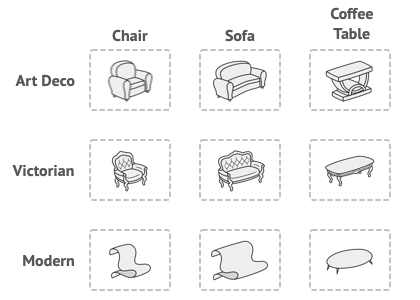

# Abstract Factory

## Intent

Abstract Factory is a creational design pattern that lets you produce families of related objects without specifying their concrete classes.

## Problem

Imagine that you’re creating a furniture shop simulator. Your code consists of classes that represent:

1. A family of related products, say: Chair + Sofa + CoffeeTable.

2. Several variants of this family. For example, products Chair + Sofa + CoffeeTable are available in these variants: Modern, Victorian, ArtDeco.



You need a way to create individual furniture objects so that they match other objects of the same family. Customers get quite mad when they receive non-matching furniture.

## Solution

The first thing the Abstract Factory pattern suggests is to explicitly declare interfaces for each distinct product of the product family (e.g., chair, sofa or coffee table). Then you can make all variants of products follow those interfaces. For example, all chair variants can implement the Chair interface; all coffee table variants can implement the CoffeeTable interface, and so on


The next move is to declare the Abstract Factory—an interface with a list of creation methods for all products that are part of the product family (for example, createChair, createSofa and createCoffeeTable). These methods must return abstract product types represented by the interfaces we extracted previously: Chair, Sofa, CoffeeTable and so on.


Now, how about the product variants? For each variant of a product family, we create a separate factory class based on the AbstractFactory interface. A factory is a class that returns products of a particular kind. For example, the ModernFurnitureFactory can only create ModernChair, ModernSofa and ModernCoffeeTable objects.

The client code has to work with both factories and products via their respective abstract interfaces. This lets you change the type of a factory that you pass to the client code, as well as the product variant that the client code receives, without breaking the actual client code.

Say the client wants a factory to produce a chair. The client doesn’t have to be aware of the factory’s class, nor does it matter what kind of chair it gets. Whether it’s a Modern model or a Victorian-style chair, the client must treat all chairs in the same manner, using the abstract Chair interface. With this approach, the only thing that the client knows about the chair is that it implements the sitOn method in some way. Also, whichever variant of the chair is returned, it’ll always match the type of sofa or coffee table produced by the same factory object.

There’s one more thing left to clarify: if the client is only exposed to the abstract interfaces, what creates the actual factory objects? Usually, the application creates a concrete factory object at the initialization stage. Just before that, the app must select the factory type depending on the configuration or the environment settings.

## Applicability

**Use the Abstract Factory when your code needs to work with various families of related products, but you don’t want it to depend on the concrete classes of those products—they might be unknown beforehand or you simply want to allow for future extensibility.**

**Consider implementing the Abstract Factory when you have a class with a set of Factory Methods that blur its primary responsibility.**

## Example

```ts
/**
 * The Abstract Factory interface declares a set of methods that return
 * different abstract products. These products are called a family and are
 * related by a high-level theme or concept. Products of one family are usually
 * able to collaborate among themselves. A family of products may have several
 * variants, but the products of one variant are incompatible with products of
 * another.
 */
interface AbstractFactory {
  createProductA(): AbstractProductA;

  createProductB(): AbstractProductB;
}

/**
 * Concrete Factories produce a family of products that belong to a single
 * variant. The factory guarantees that resulting products are compatible. Note
 * that signatures of the Concrete Factory's methods return an abstract product,
 * while inside the method a concrete product is instantiated.
 */
class ConcreteFactory1 implements AbstractFactory {
  public createProductA(): AbstractProductA {
    return new ConcreteProductA1();
  }

  public createProductB(): AbstractProductB {
    return new ConcreteProductB1();
  }
}

/**
 * Each Concrete Factory has a corresponding product variant.
 */
class ConcreteFactory2 implements AbstractFactory {
  public createProductA(): AbstractProductA {
    return new ConcreteProductA2();
  }

  public createProductB(): AbstractProductB {
    return new ConcreteProductB2();
  }
}

/**
 * Each distinct product of a product family should have a base interface. All
 * variants of the product must implement this interface.
 */
interface AbstractProductA {
  usefulFunctionA(): string;
}

/**
 * These Concrete Products are created by corresponding Concrete Factories.
 */
class ConcreteProductA1 implements AbstractProductA {
  public usefulFunctionA(): string {
    return 'The result of the product A1.';
  }
}

class ConcreteProductA2 implements AbstractProductA {
  public usefulFunctionA(): string {
    return 'The result of the product A2.';
  }
}

/**
 * Here's the the base interface of another product. All products can interact
 * with each other, but proper interaction is possible only between products of
 * the same concrete variant.
 */
interface AbstractProductB {
  /**
   * Product B is able to do its own thing...
   */
  usefulFunctionB(): string;

  /**
   * ...but it also can collaborate with the ProductA.
   *
   * The Abstract Factory makes sure that all products it creates are of the
   * same variant and thus, compatible.
   */
  anotherUsefulFunctionB(collaborator: AbstractProductA): string;
}

/**
 * These Concrete Products are created by corresponding Concrete Factories.
 */
class ConcreteProductB1 implements AbstractProductB {
  public usefulFunctionB(): string {
    return 'The result of the product B1.';
  }

  /**
   * The variant, Product B1, is only able to work correctly with the variant,
   * Product A1. Nevertheless, it accepts any instance of AbstractProductA as
   * an argument.
   */
  public anotherUsefulFunctionB(collaborator: AbstractProductA): string {
    const result = collaborator.usefulFunctionA();
    return `The result of the B1 collaborating with the (${result})`;
  }
}

class ConcreteProductB2 implements AbstractProductB {
  public usefulFunctionB(): string {
    return 'The result of the product B2.';
  }

  /**
   * The variant, Product B2, is only able to work correctly with the variant,
   * Product A2. Nevertheless, it accepts any instance of AbstractProductA as
   * an argument.
   */
  public anotherUsefulFunctionB(collaborator: AbstractProductA): string {
    const result = collaborator.usefulFunctionA();
    return `The result of the B2 collaborating with the (${result})`;
  }
}

/**
 * The client code works with factories and products only through abstract
 * types: AbstractFactory and AbstractProduct. This lets you pass any factory or
 * product subclass to the client code without breaking it.
 */
function clientCode(factory: AbstractFactory) {
  const productA = factory.createProductA();
  const productB = factory.createProductB();

  console.log(productB.usefulFunctionB());
  console.log(productB.anotherUsefulFunctionB(productA));
}

/**
 * The client code can work with any concrete factory class.
 */
console.log('Client: Testing client code with the first factory type...');
clientCode(new ConcreteFactory1());

console.log('');

console.log(
  'Client: Testing the same client code with the second factory type...'
);
clientCode(new ConcreteFactory2());
```

```
Client: Testing client code with the first factory type...
The result of the product B1.
The result of the B1 collaborating with the (The result of the product A1.)

Client: Testing the same client code with the second factory type...
The result of the product B2.
The result of the B2 collaborating with the (The result of the product A2.)
```

```ts
interface FurnitureFactory {
  createChair(): Chair;
  createSofa(): Sofa;
  createCoffeeTable(): CoffeeTable;
}

interface Chair {
  sitOn(): void;
}
interface Sofa {
  sitOn(): void;
}
interface CoffeeTable {
  putOn(): void;
}

// Implementing the concrete product classes for each furniture type

// Victorian Furniture Factory
class VictorianChair implements Chair {
  sitOn(): void {
    console.log('Sitting on a Victorian chair.');
  }
}

class VictorianSofa implements Sofa {
  sitOn(): void {
    console.log('Sitting on a Victorian sofa.');
  }
}

class VictorianCoffeeTable implements CoffeeTable {
  putOn(): void {
    console.log('Putting something on a Victorian coffee table.');
  }
}

// Modern Furniture Factory
class ModernChair implements Chair {
  sitOn(): void {
    console.log('Sitting on a Modern chair.');
  }
}

class ModernSofa implements Sofa {
  sitOn(): void {
    console.log('Sitting on a Modern sofa.');
  }
}

class ModernCoffeeTable implements CoffeeTable {
  putOn(): void {
    console.log('Putting something on a Modern coffee table.');
  }
}

// Art Deco Furniture Factory
class ArtDecoChair implements Chair {
  sitOn(): void {
    console.log('Sitting on an Art Deco chair.');
  }
}

class ArtDecoSofa implements Sofa {
  sitOn(): void {
    console.log('Sitting on an Art Deco sofa.');
  }
}

class ArtDecoCoffeeTable implements CoffeeTable {
  putOn(): void {
    console.log('Putting something on an Art Deco coffee table.');
  }
}
// Concrete Victorian Furniture Factory
class VictorianFurnitureFactory implements FurnitureFactory {
  createChair(): Chair {
    return new VictorianChair();
  }

  createSofa(): Sofa {
    return new VictorianSofa();
  }

  createCoffeeTable(): CoffeeTable {
    return new VictorianCoffeeTable();
  }
}

// Concrete Modern Furniture Factory
class ModernFurnitureFactory implements FurnitureFactory {
  createChair(): Chair {
    return new ModernChair();
  }

  createSofa(): Sofa {
    return new ModernSofa();
  }

  createCoffeeTable(): CoffeeTable {
    return new ModernCoffeeTable();
  }
}

// Concrete Art Deco Furniture Factory
class ArtDecoFurnitureFactory implements FurnitureFactory {
  createChair(): Chair {
    return new ArtDecoChair();
  }

  createSofa(): Sofa {
    return new ArtDecoSofa();
  }

  createCoffeeTable(): CoffeeTable {
    return new ArtDecoCoffeeTable();
  }
}

function clientCode(factory: FurnitureFactory) {
  const chair = factory.createChair();
  const sofa = factory.createSofa();
  const coffeeTable = factory.createCoffeeTable();

  chair.sitOn();
  sofa.sitOn();
  coffeeTable.putOn();
}

console.log(
  'Client: Testing client code with the Victorian furniture factory...'
);
clientCode(new VictorianFurnitureFactory());

console.log('');

console.log('Client: Testing client code with the Modern furniture factory...');
clientCode(new ModernFurnitureFactory());

console.log('');

console.log(
  'Client: Testing client code with the Art Deco furniture factory...'
);
clientCode(new ArtDecoFurnitureFactory());
```

```
Client: Testing client code with the Victorian furniture factory...
Sitting on a Victorian chair.
Sitting on a Victorian sofa.
Putting something on a Victorian coffee table.

Client: Testing client code with the Modern furniture factory...
Sitting on a Modern chair.
Sitting on a Modern sofa.
Putting something on a Modern coffee table.

Client: Testing client code with the Art Deco furniture factory...
Sitting on an Art Deco chair.
Sitting on an Art Deco sofa.
Putting something on an Art Deco coffee table.

```
