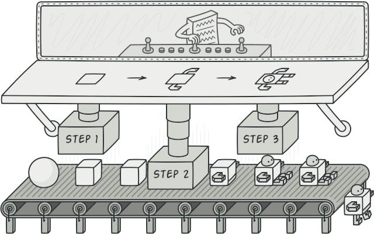
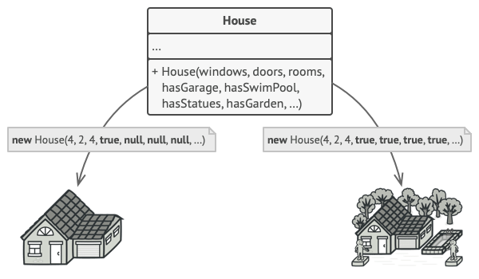
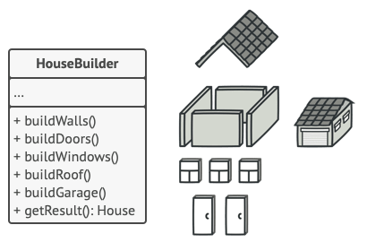

# Builder

Builder is a creational design pattern that lets you construct complex objects step by step. The pattern allows you to produce different types and representations of an object using the same construction code.



## Problem

Imagine a complex object that requires laborious, step-by-step initialization of many fields and nested objects. Such initialization code is usually buried inside a monstrous constructor with lots of parameters. Or even worse: scattered all over the client code.

For example, let’s think about how to create a House object. To build a simple house, you need to construct four walls and a floor, install a door, fit a pair of windows, and build a roof. But what if you want a bigger, brighter house, with a backyard and other goodies (like a heating system, plumbing, and electrical wiring)?

The simplest solution is to extend the base House class and create a set of subclasses to cover all combinations of the parameters. But eventually you’ll end up with a considerable number of subclasses. Any new parameter, such as the porch style, will require growing this hierarchy even more.

There’s another approach that doesn’t involve breeding subclasses. You can create a giant constructor right in the base House class with all possible parameters that control the house object. While this approach indeed eliminates the need for subclasses, it creates another problem.



In most cases most of the parameters will be unused, making the constructor calls pretty ugly. For instance, only a fraction of houses have swimming pools, so the parameters related to swimming pools will be useless nine times out of ten.

## Solution

The Builder pattern suggests that you extract the object construction code out of its own class and move it to separate objects called builders.



The pattern organizes object construction into a set of steps (buildWalls, buildDoor, etc.). To create an object, you execute a series of these steps on a builder object. The important part is that you don’t need to call all of the steps. You can call only those steps that are necessary for producing a particular configuration of an object.

Some of the construction steps might require different implementation when you need to build various representations of the product. For example, walls of a cabin may be built of wood, but the castle walls must be built with stone.

In this case, you can create several different builder classes that implement the same set of building steps, but in a different manner. Then you can use these builders in the construction process (i.e., an ordered set of calls to the building steps) to produce different kinds of objects.

### Director

You can go further and extract a series of calls to the builder steps you use to construct a product into a separate class called director. The director class defines the order in which to execute the building steps, while the builder provides the implementation for those steps.

Having a director class in your program isn’t strictly necessary. You can always call the building steps in a specific order directly from the client code. However, the director class might be a good place to put various construction routines so you can reuse them across your program.

In addition, the director class completely hides the details of product construction from the client code. The client only needs to associate a builder with a director, launch the construction with the director, and get the result from the builder.

## Applicability

- Use the Builder pattern to get rid of a “telescoping constructor”.
- Use the Builder pattern when you want your code to be able to create different representations of some product (for example, stone and wooden houses).
- Use the Builder to construct Composite trees or other complex objects.

## Example

```ts
/**
 * The Builder interface specifies methods for creating the different parts of
 * the Product objects.
 */
interface Builder {
  producePartA(): void;
  producePartB(): void;
  producePartC(): void;
}

/**
 * The Concrete Builder classes follow the Builder interface and provide
 * specific implementations of the building steps. Your program may have several
 * variations of Builders, implemented differently.
 */
class ConcreteBuilder1 implements Builder {
  private product: Product1;

  /**
   * A fresh builder instance should contain a blank product object, which is
   * used in further assembly.
   */
  constructor() {
    this.reset();
  }

  public reset(): void {
    this.product = new Product1();
  }

  /**
   * All production steps work with the same product instance.
   */
  public producePartA(): void {
    this.product.parts.push('PartA1');
  }

  public producePartB(): void {
    this.product.parts.push('PartB1');
  }

  public producePartC(): void {
    this.product.parts.push('PartC1');
  }

  /**
   * Concrete Builders are supposed to provide their own methods for
   * retrieving results. That's because various types of builders may create
   * entirely different products that don't follow the same interface.
   * Therefore, such methods cannot be declared in the base Builder interface
   * (at least in a statically typed programming language).
   *
   * Usually, after returning the end result to the client, a builder instance
   * is expected to be ready to start producing another product. That's why
   * it's a usual practice to call the reset method at the end of the
   * `getProduct` method body. However, this behavior is not mandatory, and
   * you can make your builders wait for an explicit reset call from the
   * client code before disposing of the previous result.
   */
  public getProduct(): Product1 {
    const result = this.product;
    this.reset();
    return result;
  }
}

/**
 * It makes sense to use the Builder pattern only when your products are quite
 * complex and require extensive configuration.
 *
 * Unlike in other creational patterns, different concrete builders can produce
 * unrelated products. In other words, results of various builders may not
 * always follow the same interface.
 */
class Product1 {
  public parts: string[] = [];

  public listParts(): void {
    console.log(`Product parts: ${this.parts.join(', ')}\n`);
  }
}

/**
 * The Director is only responsible for executing the building steps in a
 * particular sequence. It is helpful when producing products according to a
 * specific order or configuration. Strictly speaking, the Director class is
 * optional, since the client can control builders directly.
 */
class Director {
  private builder: Builder;

  /**
   * The Director works with any builder instance that the client code passes
   * to it. This way, the client code may alter the final type of the newly
   * assembled product.
   */
  public setBuilder(builder: Builder): void {
    this.builder = builder;
  }

  /**
   * The Director can construct several product variations using the same
   * building steps.
   */
  public buildMinimalViableProduct(): void {
    this.builder.producePartA();
  }

  public buildFullFeaturedProduct(): void {
    this.builder.producePartA();
    this.builder.producePartB();
    this.builder.producePartC();
  }
}

/**
 * The client code creates a builder object, passes it to the director and then
 * initiates the construction process. The end result is retrieved from the
 * builder object.
 */
function clientCode(director: Director) {
  const builder = new ConcreteBuilder1();
  director.setBuilder(builder);

  console.log('Standard basic product:');
  director.buildMinimalViableProduct();
  builder.getProduct().listParts();

  console.log('Standard full featured product:');
  director.buildFullFeaturedProduct();
  builder.getProduct().listParts();

  // Remember, the Builder pattern can be used without a Director class.
  console.log('Custom product:');
  builder.producePartA();
  builder.producePartC();
  builder.getProduct().listParts();
}

const director = new Director();
clientCode(director);
```

```
Standard basic product:
Product parts: PartA1

Standard full featured product:
Product parts: PartA1, PartB1, PartC1

Custom product:
Product parts: PartA1, PartC1
```

## A Real world example

```ts
// Interface for the MealBuilder
interface MealBuilder {
  setMainCourse(mainCourse: string): void;
  setSideDish(sideDish: string): void;
  setDrink(drink: string): void;
  setDessert(dessert: string): void;
  getResult(): Meal;
}

// Class representing a Meal
class Meal {
  private mainCourse: string;
  private sideDish: string;
  private drink: string;
  private dessert: string;

  constructor() {
    this.mainCourse = '';
    this.sideDish = '';
    this.drink = '';
    this.dessert = '';
  }

  public setMainCourse(mainCourse: string) {
    this.mainCourse = mainCourse;
  }

  public setSideDish(sideDish: string) {
    this.sideDish = sideDish;
  }

  public setDrink(drink: string) {
    this.drink = drink;
  }

  public setDessert(dessert: string) {
    this.dessert = dessert;
  }

  public showMeal(): void {
    console.log(`Main Course: ${this.mainCourse}`);
    console.log(`Side Dish: ${this.sideDish}`);
    console.log(`Drink: ${this.drink}`);
    console.log(`Dessert: ${this.dessert}`);
  }
}

class CustomMealBuilder implements MealBuilder {
  private meal: Meal;

  constructor() {
    this.meal = new Meal();
  }

  public setMainCourse(mainCourse: string) {
    this.meal.setMainCourse(mainCourse);
  }

  public setSideDish(sideDish: string) {
    this.meal.setSideDish(sideDish);
  }

  public setDrink(drink: string) {
    this.meal.setDrink(drink);
  }

  public setDessert(dessert: string) {
    this.meal.setDessert(dessert);
  }

  public getResult(): Meal {
    return this.meal;
  }
}


```

````
// Client code
const builder = new CustomMealBuilder();

// Building the custom meal step by step
builder.setMainCourse('Grilled Chicken');
builder.setSideDish('Mashed Potatoes');
builder.setDrink('Coke');
builder.setDessert('Chocolate Cake');

// Get the final custom meal
const customMeal = builder.getResult();

// Display the custom meal
customMeal.showMeal();

```Ï