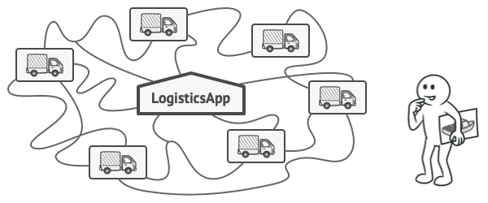
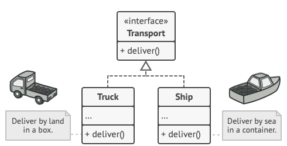
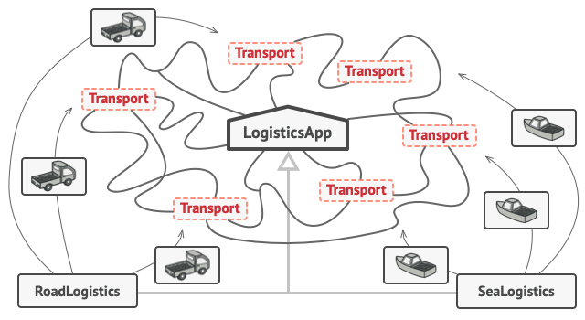

# Factory Method

Also known as: Virtual Constructor

## Intent

Factory Method is a creational design pattern that provides an interface for creating objects in a superclass, but allows subclasses to alter the type of objects that will be created.

## Problem

Imagine that you’re creating a logistics management application. The first version of your app can only handle transportation by trucks, so the bulk of your code lives inside the Truck class.

After a while, your app becomes pretty popular. Each day you receive dozens of requests from sea transportation companies to incorporate sea logistics into the app. 

At present, most of your code is coupled to the Truck class. Adding Ships into the app would require making changes to the entire codebase. Moreover, if later you decide to add another type of transportation to the app, you will probably need to make all of these changes again.

## Solution

The Factory Method pattern suggests that you replace direct object construction calls (using the new operator) with calls to a special factory method. Don’t worry: the objects are still created via the new operator, but it’s being called from within the factory method. Objects returned by a factory method are often referred to as products.

At first glance, this change may look pointless: we just moved the constructor call from one part of the program to another. However, consider this: now you can override the factory method in a subclass and change the class of products being created by the method.

There’s a slight limitation though: subclasses may return different types of products only if these products have a common base class or interface. Also, the factory method in the base class should have its return type declared as this interface.



For example, both Truck and Ship classes should implement the Transport interface, which declares a method called deliver. Each class implements this method differently: trucks deliver cargo by land, ships deliver cargo by sea. The factory method in the RoadLogistics class returns truck objects, whereas the factory method in the SeaLogistics class returns ships.



The code that uses the factory method (often called the client code) doesn’t see a difference between the actual products returned by various subclasses. The client treats all the products as abstract Transport. The client knows that all transport objects are supposed to have the deliver method, but exactly how it works isn’t important to the client.

## Structure

1. The **product** declares the interface, which is common to all objects that can be produced by the creator and its subclasses
2. **Concrete products** are different implementations of the product interface
3. The **Creator** class declares the factory method that returns new product objects. It's important that the return type of this product mehtods matches the product interface. You can declare the factory method as abstract to force all subclasses to implement their own versions of the method. As an alternative, the base factory method can return some default product type.
4. **Concrete creators** override the basefactory method so it returns a different type of produt.


## Applicability

- Use the Factory Method when you don’t know beforehand the exact types and dependencies of the objects your code should work with.
- Use the Factory Method when you want to provide users of your library or framework with a way to extend its internal components.
- Use the Factory Method when you want to save system resources by reusing existing objects instead of rebuilding them each time.

## How to implement

1. Make all products follow the same interface. This interface should declare methods that make sense in every product.
2. Add an empty factory method inside the creator class. The return type of the method should match the common product interface.
3. In the creator's code find all reference to product constructors. One by one, replace them with calls to the factory method, while extracting the product creation code into the factory method. You might need to add a temporary parameter to the factory method to control the type of returned product.
4. Now create a set of creator subclasses for each type of product listed in the factory method. Override the factory method in the subclasses and extract the appropriate bits of construction code from the base method
5. If there are too many product types and it doesn't make sense to create subclasses for all of them you can reuse teh control parameter from the bse in subclasses. For instance, imagine that you have the following hierarchy of classes: the base Mail class with a couple of subclasses: AirMail and GroundMail; the Transport classes are Plane, Truck and Train. While the AirMail class only uses Plane objects, GroundMail may work with both Truck and Train objects. You can create a new subclass (say TrainMail) to handle both cases, but there’s another option. The client code can pass an argument to the factory method of the GroundMail class to control which product it wants to receive.

6. If, after all of the extractions, the base factory method has become empty, you can make it abstract. If there’s something left, you can make it a default behavior of the method.

## Code example

```ts
/**
 * The Creator class declares the factory method that is supposed to return an
 * object of a Product class. The Creator's subclasses usually provide the
 * implementation of this method.
 */
abstract class Creator {
  /**
   * Note that the Creator may also provide some default implementation of the
   * factory method.
   */
  public abstract factoryMethod(): Product;

  /**
   * Also note that, despite its name, the Creator's primary responsibility is
   * not creating products. Usually, it contains some core business logic that
   * relies on Product objects, returned by the factory method. Subclasses can
   * indirectly change that business logic by overriding the factory method
   * and returning a different type of product from it.
   */
  public someOperation(): string {
    // Call the factory method to create a Product object.
    const product = this.factoryMethod();
    // Now, use the product.
    return `Creator: The same creator's code has just worked with ${product.operation()}`;
  }
}

/**
 * Concrete Creators override the factory method in order to change the
 * resulting product's type.
 */
class ConcreteCreator1 extends Creator {
  /**
   * Note that the signature of the method still uses the abstract product
   * type, even though the concrete product is actually returned from the
   * method. This way the Creator can stay independent of concrete product
   * classes.
   */
  public factoryMethod(): Product {
    return new ConcreteProduct1();
  }
}

class ConcreteCreator2 extends Creator {
  public factoryMethod(): Product {
    return new ConcreteProduct2();
  }
}

/**
 * The Product interface declares the operations that all concrete products must
 * implement.
 */
interface Product {
  operation(): string;
}

/**
 * Concrete Products provide various implementations of the Product interface.
 */
class ConcreteProduct1 implements Product {
  public operation(): string {
    return '{Result of the ConcreteProduct1}';
  }
}

class ConcreteProduct2 implements Product {
  public operation(): string {
    return '{Result of the ConcreteProduct2}';
  }
}

/**
 * The client code works with an instance of a concrete creator, albeit through
 * its base interface. As long as the client keeps working with the creator via
 * the base interface, you can pass it any creator's subclass.
 */
function clientCode(creator: Creator) {
  // ...
  console.log("Client: I'm not aware of the creator's class, but it still works.");
  console.log(creator.someOperation());
  // ...
}

/**
 * The Application picks a creator's type depending on the configuration or
 * environment.
 */
console.log('App: Launched with the ConcreteCreator1.');
clientCode(new ConcreteCreator1());
console.log('');

console.log('App: Launched with the ConcreteCreator2.');
clientCode(new ConcreteCreator2());
```

```
App: Launched with the ConcreteCreator1.
Client: I'm not aware of the creator's class, but it still works.
Creator: The same creator's code has just worked with {Result of the ConcreteProduct1}

App: Launched with the ConcreteCreator2.
Client: I'm not aware of the creator's class, but it still works.
Creator: The same creator's code has just worked with {Result of the ConcreteProduct2}

```
