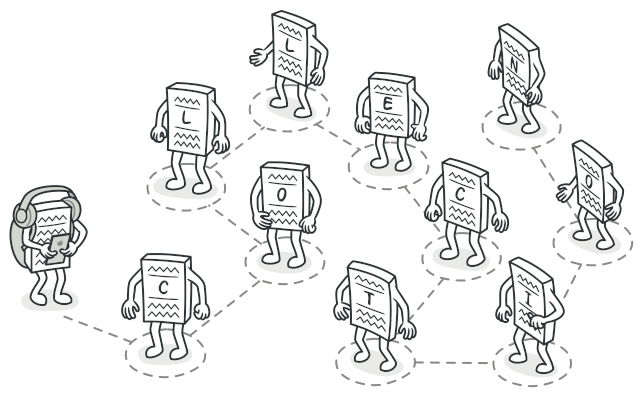

# Iterator

Iterator is a behavioral design pattern that lets you traverse elements of a collection without exposing its underlying representation (list, stack, tree, etc.).



## Problem

Collections are one of the most used data types in programming. Nonetheless, a collection is just a container for a group of objects.


Most collections store their elements in simple lists. However, some of them are based on stacks, trees, graphs and other complex data structures.

But no matter how a collection is structured, it must provide some way of accessing its elements so that other code can use these elements. There should be a way to go through each element of the collection without accessing the same elements over and over.

This may sound like an easy job if you have a collection based on a list. You just loop over all of the elements. But how do you sequentially traverse elements of a complex data structure, such as a tree? For example, one day you might be just fine with depth-first traversal of a tree. Yet the next day you might require breadth-first traversal. And the next week, you might need something else, like random access to the tree elements.


Adding more and more traversal algorithms to the collection gradually blurs its primary responsibility, which is efficient data storage. Additionally, some algorithms might be tailored for a specific application, so including them into a generic collection class would be weird.

On the other hand, the client code that’s supposed to work with various collections may not even care how they store their elements. However, since collections all provide different ways of accessing their elements, you have no option other than to couple your code to the specific collection classes.

## Solution

The main idea of the Iterator pattern is to extract the traversal behavior of a collection into a separate object called an iterator.

In addition to implementing the algorithm itself, an iterator object encapsulates all of the traversal details, such as the current position and how many elements are left till the end. Because of this, several iterators can go through the same collection at the same time, independently of each other.

Usually, iterators provide one primary method for fetching elements of the collection. The client can keep running this method until it doesn’t return anything, which means that the iterator has traversed all of the elements.

All iterators must implement the same interface. This makes the client code compatible with any collection type or any traversal algorithm as long as there’s a proper iterator. If you need a special way to traverse a collection, you just create a new iterator class, without having to change the collection or the client.

## Applicability

- Use the Iterator pattern when your collection has a complex data structure under the hood, but you want to hide its complexity from clients (either for convenience or security reasons).

- Use the pattern to reduce duplication of the traversal code across your app.

- Use the Iterator when you want your code to be able to traverse different data structures or when types of these structures are unknown beforehand.

## Example in Typescript

```ts
/**
 * Iterator Design Pattern
 *
 * Intent: Lets you traverse elements of a collection without exposing its
 * underlying representation (list, stack, tree, etc.).
 */

interface Iterator<T> {
  // Return the current element.
  current(): T;

  // Return the current element and move forward to next element.
  next(): T;

  // Return the key of the current element.
  key(): number;

  // Checks if current position is valid.
  valid(): boolean;

  // Rewind the Iterator to the first element.
  rewind(): void;
}

interface Aggregator {
  // Retrieve an external iterator.
  getIterator(): Iterator<string>;
}

/**
 * Concrete Iterators implement various traversal algorithms. These classes
 * store the current traversal position at all times.
 */

class AlphabeticalOrderIterator implements Iterator<string> {
  private collection: WordsCollection;

  /**
   * Stores the current traversal position. An iterator may have a lot of
   * other fields for storing iteration state, especially when it is supposed
   * to work with a particular kind of collection.
   */
  private position: number = 0;

  /**
   * This variable indicates the traversal direction.
   */
  private reverse: boolean = false;

  constructor(collection: WordsCollection, reverse: boolean = false) {
    this.collection = collection;
    this.reverse = reverse;

    if (reverse) {
      this.position = collection.getCount() - 1;
    }
  }

  public rewind() {
    this.position = this.reverse ? this.collection.getCount() - 1 : 0;
  }

  public current(): string {
    return this.collection.getItems()[this.position];
  }

  public key(): number {
    return this.position;
  }

  public next(): string {
    const item = this.collection.getItems()[this.position];
    this.position += this.reverse ? -1 : 1;
    return item;
  }

  public valid(): boolean {
    if (this.reverse) {
      return this.position >= 0;
    }

    return this.position < this.collection.getCount();
  }
}

/**
 * Concrete Collections provide one or several methods for retrieving fresh
 * iterator instances, compatible with the collection class.
 */
class WordsCollection implements Aggregator {
  private items: string[] = [];

  public getItems(): string[] {
    return this.items;
  }

  public getCount(): number {
    return this.items.length;
  }

  public addItem(item: string): void {
    this.items.push(item);
  }

  public getIterator(): Iterator<string> {
    return new AlphabeticalOrderIterator(this);
  }

  public getReverseIterator(): Iterator<string> {
    return new AlphabeticalOrderIterator(this, true);
  }
}

/**
 * The client code may or may not know about the Concrete Iterator or Collection
 * classes, depending on the level of indirection you want to keep in your
 * program.
 */
const collection = new WordsCollection();
collection.addItem('First');
collection.addItem('Second');
collection.addItem('Third');

const iterator = collection.getIterator();

console.log('Straight traversal:');
while (iterator.valid()) {
  console.log(iterator.next());
}

console.log('');
console.log('Reverse traversal:');
const reverseIterator = collection.getReverseIterator();
while (reverseIterator.valid()) {
  console.log(reverseIterator.next());
}
```

```
Straight traversal:
First
Second
Third

Reverse traversal:
Third
Second
First

```
