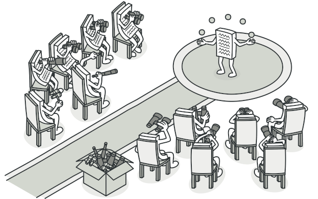

# Observer

## Intent

Observer is a behavioral design pattern that lets you define a subscription mechanism to notify multiple objects about any events that happen to the object they’re observing.



## Problem

Imagine that you have two types of objects: a Customer and a Store. The customer is very interested in a particular brand of product (say, it’s a new model of the iPhone) which should become available in the store very soon.

The customer could visit the store every day and check product availability. But while the product is still en route, most of these trips would be pointless

On the other hand, the store could send tons of emails (which might be considered spam) to all customers each time a new product becomes available. This would save some customers from endless trips to the store. At the same time, it’d upset other customers who aren’t interested in new products.

It looks like we’ve got a conflict. Either the customer wastes time checking product availability or the store wastes resources notifying the wrong customers.

## Solution

The object that has some interesting state is often called subject, but since it’s also going to notify other objects about the changes to its state, we’ll call it publisher. All other objects that want to track changes to the publisher’s state are called subscribers.

The Observer pattern suggests that you add a subscription mechanism to the publisher class so individual objects can subscribe to or unsubscribe from a stream of events coming from that publisher. Fear not! Everything isn’t as complicated as it sounds. In reality, this mechanism consists of 1) an array field for storing a list of references to subscriber objects and 2) several public methods which allow adding subscribers to and removing them from that list.

Now, whenever an important event happens to the publisher, it goes over its subscribers and calls the specific notification method on their objects.

Real apps might have dozens of different subscriber classes that are interested in tracking events of the same publisher class. You wouldn’t want to couple the publisher to all of those classes. Besides, you might not even know about some of them beforehand if your publisher class is supposed to be used by other people.

That’s why it’s crucial that all subscribers implement the same interface and that the publisher communicates with them only via that interface. This interface should declare the notification method along with a set of parameters that the publisher can use to pass some contextual data along with the notification.

If your app has several different types of publishers and you want to make your subscribers compatible with all of them, you can go even further and make all publishers follow the same interface. This interface would only need to describe a few subscription methods. The interface would allow subscribers to observe publishers’ states without coupling to their concrete classes.

## Applicability

- Use the Observer pattern when changes to the state of one object may require changing other objects, and the actual set of objects is unknown beforehand or changes dynamically

- Use the pattern when some objects in your app must observe others, but only for a limited time or in specific cases.

## Code example

```ts
/**
 * The Subject interface declares a set of methods for managing subscribers.
 */
interface Subject {
  // Attach an observer to the subject.
  attach(observer: Observer): void;

  // Detach an observer from the subject.
  detach(observer: Observer): void;

  // Notify all observers about an event.
  notify(): void;
}

/**
 * The Subject owns some important state and notifies observers when the state
 * changes.
 */
class ConcreteSubject implements Subject {
  /**
   * @type {number} For the sake of simplicity, the Subject's state, essential
   * to all subscribers, is stored in this variable.
   */
  public state: number;

  /**
   * @type {Observer[]} List of subscribers. In real life, the list of
   * subscribers can be stored more comprehensively (categorized by event
   * type, etc.).
   */
  private observers: Observer[] = [];

  /**
   * The subscription management methods.
   */
  public attach(observer: Observer): void {
    const isExist = this.observers.includes(observer);
    if (isExist) {
      return console.log('Subject: Observer has been attached already.');
    }

    console.log('Subject: Attached an observer.');
    this.observers.push(observer);
  }

  public detach(observer: Observer): void {
    const observerIndex = this.observers.indexOf(observer);
    if (observerIndex === -1) {
      return console.log('Subject: Nonexistent observer.');
    }

    this.observers.splice(observerIndex, 1);
    console.log('Subject: Detached an observer.');
  }

  /**
   * Trigger an update in each subscriber.
   */
  public notify(): void {
    console.log('Subject: Notifying observers...');
    for (const observer of this.observers) {
      observer.update(this);
    }
  }

  /**
   * Usually, the subscription logic is only a fraction of what a Subject can
   * really do. Subjects commonly hold some important business logic, that
   * triggers a notification method whenever something important is about to
   * happen (or after it).
   */
  public someBusinessLogic(): void {
    console.log("\nSubject: I'm doing something important.");
    this.state = Math.floor(Math.random() * (10 + 1));

    console.log(`Subject: My state has just changed to: ${this.state}`);
    this.notify();
  }
}

/**
 * The Observer interface declares the update method, used by subjects.
 */
interface Observer {
  // Receive update from subject.
  update(subject: Subject): void;
}

/**
 * Concrete Observers react to the updates issued by the Subject they had been
 * attached to.
 */
class ConcreteObserverA implements Observer {
  public update(subject: Subject): void {
    if (subject instanceof ConcreteSubject && subject.state < 3) {
      console.log('ConcreteObserverA: Reacted to the event.');
    }
  }
}

class ConcreteObserverB implements Observer {
  public update(subject: Subject): void {
    if (
      subject instanceof ConcreteSubject &&
      (subject.state === 0 || subject.state >= 2)
    ) {
      console.log('ConcreteObserverB: Reacted to the event.');
    }
  }
}

/**
 * The client code.
 */

const subject = new ConcreteSubject();

const observer1 = new ConcreteObserverA();
subject.attach(observer1);

const observer2 = new ConcreteObserverB();
subject.attach(observer2);

subject.someBusinessLogic();
subject.someBusinessLogic();

subject.detach(observer2);

subject.someBusinessLogic();
```

```
Subject: Attached an observer.
Subject: Attached an observer.

Subject: I'm doing something important.
Subject: My state has just changed to: 6
Subject: Notifying observers...
ConcreteObserverB: Reacted to the event.

Subject: I'm doing something important.
Subject: My state has just changed to: 1
Subject: Notifying observers...
ConcreteObserverA: Reacted to the event.
Subject: Detached an observer.

Subject: I'm doing something important.
Subject: My state has just changed to: 5
Subject: Notifying observers...

```

## Real world example

```ts
class Post implements Subject {
  // State of the post
  public likes: number = 0;
  public comments: number = 0;

  private observers: Observer[] = [];

  // Attach an observer to the post.
  attach(observer: Observer): void {
    this.observers.push(observer);
  }

  // Detach an observer from the post.
  detach(observer: Observer): void {
    const index = this.observers.indexOf(observer);
    if (index !== -1) {
      this.observers.splice(index, 1);
    }
  }

  // Notify all observers about a post update.
  notify(): void {
    for (const observer of this.observers) {
      observer.update(this);
    }
  }

  // Methods for updating post state
  like(): void {
    this.likes++;
    this.notify();
  }

  comment(): void {
    this.comments++;
    this.notify();
  }
}

class User implements Observer {
  constructor(private name: string) {}

  // Receive an update from a post.
  update(subject: Subject): void {
    if (subject instanceof Post) {
      console.log(
        `${this.name} received an update: ${subject.likes} likes, ${subject.comments} comments.`
      );
    }
  }
}

// Client Code

const post = new Post();

const user1 = new User('UserA');
post.attach(user1);

const user2 = new User('UserB');
post.attach(user2);

post.like(); // Both UserA and UserB receive an update.
post.comment(); // Both UserA and UserB receive an update.

// User2 loses interest in the post
post.detach(user2);

post.like(); // Only UserA receives an update.
```
