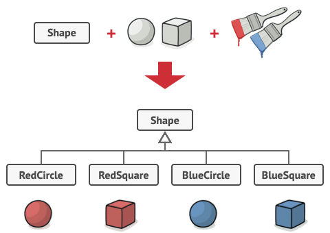

# Bridge

The Bridge Design Pattern is a structural design pattern that separates an object's abstraction from its implementation. It allows you to create a hierarchy of abstractions and implementations independently, and then bridge them together, providing flexibility and extensibility. This pattern is particularly useful when you have multiple variations of both abstractions and implementations, and you want to avoid a combinatorial explosion of classes.


## Problem

Say you have a geometric Shape class with a pair of subclasses: Circle and Square. You want to extend this class hierarchy to incorporate colors, so you plan to create Red and Blue shape subclasses. However, since you already have two subclasses, you’ll need to create four class combinations such as BlueCircle and RedSquare.



Adding new shape types and colors to the hierarchy will grow it exponentially. For example, to add a triangle shape you’d need to introduce two subclasses, one for each color. And after that, adding a new color would require creating three subclasses, one for each shape type. The further we go, the worse it becomes.

## Solution

This problem occurs because we’re trying to extend the shape classes in two independent dimensions: by form and by color. That’s a very common issue with class inheritance.

The Bridge pattern attempts to solve this problem by switching from inheritance to the object composition. What this means is that you extract one of the dimensions into a separate class hierarchy, so that the original classes will reference an object of the new hierarchy, instead of having all of its state and behaviors within one class.


Following this approach, we can extract the color-related code into its own class with two subclasses: Red and Blue. The Shape class then gets a reference field pointing to one of the color objects. Now the shape can delegate any color-related work to the linked color object. That reference will act as a bridge between the Shape and Color classes. From now on, adding new colors won’t require changing the shape hierarchy, and vice versa.

### Abstraction and Implementation

Abstraction (also called interface) is a high-level control layer for some entity. This layer isn’t supposed to do any real work on its own. It should delegate the work to the implementation layer (also called platform).

Note that we’re not talking about interfaces or abstract classes from your programming language. These aren’t the same things.

When talking about real applications, the abstraction can be represented by a graphical user interface (GUI), and the implementation could be the underlying operating system code (API) which the GUI layer calls in response to user interactions.

Generally speaking, you can extend such an app in two independent directions:

- Have several different GUIs (for instance, tailored for regular customers or admins).
  Support several different APIs (for example, to be able to launch the app under Windows, Linux, and macOS).
- In a worst-case scenario, this app might look like a giant spaghetti bowl, where hundreds of conditionals connect different types of GUI with various APIs all over the code.


You can bring order to this chaos by extracting the code related to specific interface-platform combinations into separate classes. However, soon you’ll discover that there are lots of these classes. The class hierarchy will grow exponentially because adding a new GUI or supporting a different API would require creating more and more classes.

Let’s try to solve this issue with the Bridge pattern. It suggests that we divide the classes into two hierarchies:

- Abstraction: the GUI layer of the app.
- Implementation: the operating systems’ APIs.


The abstraction object controls the appearance of the app, delegating the actual work to the linked implementation object. Different implementations are interchangeable as long as they follow a common interface, enabling the same GUI to work under Windows and Linux.

As a result, you can change the GUI classes without touching the API-related classes. Moreover, adding support for another operating system only requires creating a subclass in the implementation hierarchy.

## Applicability

Use the Bridge pattern when you want to divide and organize a monolithic class that has several variants of some functionality (for example, if the class can work with various database servers).

Use the pattern when you need to extend a class in several orthogonal (independent) dimensions.

Use the Bridge if you need to be able to switch implementations at runtime.

```ts
/**
 * The Abstraction defines the interface for the "control" part of the two class
 * hierarchies. It maintains a reference to an object of the Implementation
 * hierarchy and delegates all of the real work to this object.
 */
class Abstraction {
  protected implementation: Implementation;

  constructor(implementation: Implementation) {
    this.implementation = implementation;
  }

  public operation(): string {
    const result = this.implementation.operationImplementation();
    return `Abstraction: Base operation with:\n${result}`;
  }
}

/**
 * You can extend the Abstraction without changing the Implementation classes.
 */
class ExtendedAbstraction extends Abstraction {
  public operation(): string {
    const result = this.implementation.operationImplementation();
    return `ExtendedAbstraction: Extended operation with:\n${result}`;
  }
}

/**
 * The Implementation defines the interface for all implementation classes. It
 * doesn't have to match the Abstraction's interface. In fact, the two
 * interfaces can be entirely different. Typically the Implementation interface
 * provides only primitive operations, while the Abstraction defines higher-
 * level operations based on those primitives.
 */
interface Implementation {
  operationImplementation(): string;
}

/**
 * Each Concrete Implementation corresponds to a specific platform and
 * implements the Implementation interface using that platform's API.
 */
class ConcreteImplementationA implements Implementation {
  public operationImplementation(): string {
    return "ConcreteImplementationA: Here's the result on the platform A.";
  }
}

class ConcreteImplementationB implements Implementation {
  public operationImplementation(): string {
    return "ConcreteImplementationB: Here's the result on the platform B.";
  }
}

/**
 * Except for the initialization phase, where an Abstraction object gets linked
 * with a specific Implementation object, the client code should only depend on
 * the Abstraction class. This way the client code can support any abstraction-
 * implementation combination.
 */
function clientCode(abstraction: Abstraction) {
  // ..

  console.log(abstraction.operation());

  // ..
}

/**
 * The client code should be able to work with any pre-configured abstraction-
 * implementation combination.
 */
let implementation = new ConcreteImplementationA();
let abstraction = new Abstraction(implementation);
clientCode(abstraction);

console.log('');

implementation = new ConcreteImplementationB();
abstraction = new ExtendedAbstraction(implementation);
clientCode(abstraction);
```

```
Abstraction: Base operation with:
ConcreteImplementationA: Here's the result on the platform A.

ExtendedAbstraction: Extended operation with:
ConcreteImplementationB: Here's the result on the platform B.
```

## Another example

Abstraction: This defines the interface for the high-level abstraction. In our case, it's the Shape interface.

```ts
interface Shape {
  draw(): void;
}
```

Implementations: These are the concrete implementations for rendering. We'll define two rendering methods: SVGRenderer and CanvasRenderer.

```ts
interface Renderer {
  renderCircle(): void;
  renderSquare(): void;
}

class SVGRenderer implements Renderer {
  renderCircle() {
    console.log('Rendering circle using SVG');
  }

  renderSquare() {
    console.log('Rendering square using SVG');
  }
}

class CanvasRenderer implements Renderer {
  renderCircle() {
    console.log('Rendering circle using Canvas');
  }

  renderSquare() {
    console.log('Rendering square using Canvas');
  }
}
```

Abstraction Implementations: These are concrete implementations of the abstraction that utilize the implementation hierarchy. We will create Circle and Square classes that implement the Shape interface and take a Renderer as a parameter.

```ts
class Circle implements Shape {
  constructor(private renderer: Renderer) {}

  draw() {
    this.renderer.renderCircle();
  }
}

class Square implements Shape {
  constructor(private renderer: Renderer) {}

  draw() {
    this.renderer.renderSquare();
  }
}
```

Usage:

Now, you can use the Bridge pattern to draw shapes using different rendering methods:

```ts
const svgRenderer = new SVGRenderer();
const canvasRenderer = new CanvasRenderer();

const circleSVG = new Circle(svgRenderer);
const squareCanvas = new Square(canvasRenderer);

circleSVG.draw(); // Output: Rendering circle using SVG
squareCanvas.draw(); // Output: Rendering square using Canvas
```
