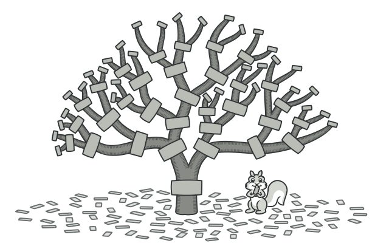
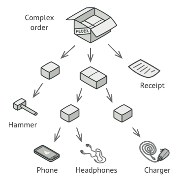

# Composite

## Intent

Composite is a structural design pattern that lets you compose objects into tree structures and then work with these structures as if they were individual objects.



## Problem

Using the Composite pattern makes sense only when the core model of your app can be represented as a tree.

For example, imagine that you have two types of objects: Products and Boxes. A Box can contain several Products as well as a number of smaller Boxes. These little Boxes can also hold some Products or even smaller Boxes, and so on.

Say you decide to create an ordering system that uses these classes. Orders could contain simple products without any wrapping, as well as boxes stuffed with products...and other boxes. How would you determine the total price of such an order?


You could try the direct approach: unwrap all the boxes, go over all the products and then calculate the total. That would be doable in the real world; but in a program, it’s not as simple as running a loop. You have to know the classes of Products and Boxes you’re going through, the nesting level of the boxes and other nasty details beforehand. All of this makes the direct approach either too awkward or even impossible.

## Solution

The Composite pattern suggests that you work with Products and Boxes through a common interface which declares a method for calculating the total price.

How would this method work? For a product, it’d simply return the product’s price. For a box, it’d go over each item the box contains, ask its price and then return a total for this box. If one of these items were a smaller box, that box would also start going over its contents and so on, until the prices of all inner components were calculated. A box could even add some extra cost to the final price, such as packaging cost.


The greatest benefit of this approach is that you don’t need to care about the concrete classes of objects that compose the tree. You don’t need to know whether an object is a simple product or a sophisticated box. You can treat them all the same via the common interface. When you call a method, the objects themselves pass the request down the tree.

## Applicability

- Use the Composite pattern when you have to implement a tree-like object structure
- Use the pattern when you want the client code to treat both simple and complex elements uniformly.

## Code example

```ts
/**
 * The base Component class declares common operations for both simple and
 * complex objects of a composition.
 */
abstract class Component {
  protected parent!: Component | null;

  /**
   * Optionally, the base Component can declare an interface for setting and
   * accessing a parent of the component in a tree structure. It can also
   * provide some default implementation for these methods.
   */
  public setParent(parent: Component | null) {
    this.parent = parent;
  }

  public getParent(): Component | null {
    return this.parent;
  }

  /**
   * In some cases, it would be beneficial to define the child-management
   * operations right in the base Component class. This way, you won't need to
   * expose any concrete component classes to the client code, even during the
   * object tree assembly. The downside is that these methods will be empty
   * for the leaf-level components.
   */
  public add(component: Component): void {}

  public remove(component: Component): void {}

  /**
   * You can provide a method that lets the client code figure out whether a
   * component can bear children.
   */
  public isComposite(): boolean {
    return false;
  }

  /**
   * The base Component may implement some default behavior or leave it to
   * concrete classes (by declaring the method containing the behavior as
   * "abstract").
   */
  public abstract operation(): string;
}

/**
 * The Leaf class represents the end objects of a composition. A leaf can't have
 * any children.
 *
 * Usually, it's the Leaf objects that do the actual work, whereas Composite
 * objects only delegate to their sub-components.
 */
class Leaf extends Component {
  public operation(): string {
    return 'Leaf';
  }
}

/**
 * The Composite class represents the complex components that may have children.
 * Usually, the Composite objects delegate the actual work to their children and
 * then "sum-up" the result.
 */
class Composite extends Component {
  protected children: Component[] = [];

  /**
   * A composite object can add or remove other components (both simple or
   * complex) to or from its child list.
   */
  public add(component: Component): void {
    this.children.push(component);
    component.setParent(this);
  }

  public remove(component: Component): void {
    const componentIndex = this.children.indexOf(component);
    this.children.splice(componentIndex, 1);

    component.setParent(null);
  }

  public isComposite(): boolean {
    return true;
  }

  /**
   * The Composite executes its primary logic in a particular way. It
   * traverses recursively through all its children, collecting and summing
   * their results. Since the composite's children pass these calls to their
   * children and so forth, the whole object tree is traversed as a result.
   */
  public operation(): string {
    const results = [];
    for (const child of this.children) {
      results.push(child.operation());
    }

    return `Branch(${results.join('+')})`;
  }
}

/**
 * The client code works with all of the components via the base interface.
 */
function clientCode(component: Component) {
  // ...

  console.log(`RESULT: ${component.operation()}`);

  // ...
}

/**
 * This way the client code can support the simple leaf components...
 */
const simple = new Leaf();
console.log("Client: I've got a simple component:");
clientCode(simple);
console.log('');

/**
 * ...as well as the complex composites.
 */
const tree = new Composite();
const branch1 = new Composite();
branch1.add(new Leaf());
branch1.add(new Leaf());
const branch2 = new Composite();
branch2.add(new Leaf());
tree.add(branch1);
tree.add(branch2);
console.log("Client: Now I've got a composite tree:");
clientCode(tree);
console.log('');

/**
 * Thanks to the fact that the child-management operations are declared in the
 * base Component class, the client code can work with any component, simple or
 * complex, without depending on their concrete classes.
 */
function clientCode2(component1: Component, component2: Component) {
  // ...

  if (component1.isComposite()) {
    component1.add(component2);
  }
  console.log(`RESULT: ${component1.operation()}`);

  // ...
}

console.log(
  "Client: I don't need to check the components classes even when managing the tree:"
);
clientCode2(tree, simple);
```

```
Client: I've got a simple component:
RESULT: Leaf

Client: Now I've got a composite tree:
RESULT: Branch(Branch(Leaf+Leaf)+Branch(Leaf))

Client: I don't need to check the components classes even when managing the tree:
RESULT: Branch(Branch(Leaf+Leaf)+Branch(Leaf)+Leaf)

```
