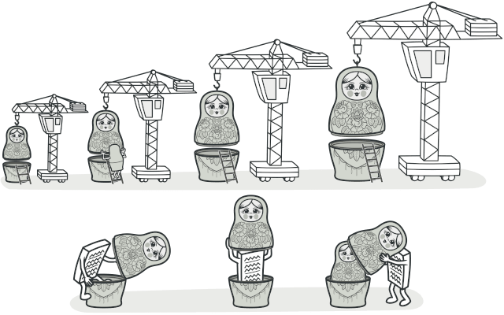
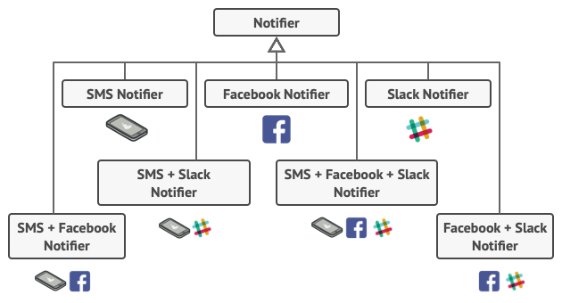
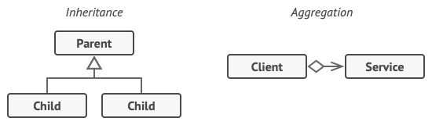

# Decorator

## Intent

Decorator is a structural design pattern that lets you attach new behaviors to objects by placing these objects inside special wrapper objects that contain the behaviors


## Problem

Imagine that you’re working on a notification library which lets other programs notify their users about important events.

The initial version of the library was based on the Notifier class that had only a few fields, a constructor and a single send method. The method could accept a message argument from a client and send the message to a list of emails that were passed to the notifier via its constructor. A third-party app which acted as a client was supposed to create and configure the notifier object once, and then use it each time something important happened.

At some point, you realize that users of the library expect more than just email notifications. Many of them would like to receive an SMS about critical issues. Others would like to be notified on Facebook and, of course, the corporate users would love to get Slack notifications.

How hard can that be? You extended the Notifier class and put the additional notification methods into new subclasses. Now the client was supposed to instantiate the desired notification class and use it for all further notifications.

But then someone reasonably asked you, “Why can’t you use several notification types at once? If your house is on fire, you’d probably want to be informed through every channel.”

You tried to address that problem by creating special subclasses which combined several notification methods within one class. However, it quickly became apparent that this approach would bloat the code immensely, not only the library code but the client code as well.



## Solution

One of the ways to overcome the caveats of inheritance is by using Aggregation or Composition instead of Inheritance. Both of the alternatives work almost the same way: one object has a reference to another and delegates it some work, whereas with inheritance, the object itself is able to do that work, inheriting the behavior from its superclass.

With this new approach you can easily substitute the linked “helper” object with another, changing the behavior of the container at runtime. An object can use the behavior of various classes, having references to multiple objects and delegating them all kinds of work. Aggregation/composition is the key principle behind many design patterns, including Decorator. On that note, let’s return to the pattern discussion.



“Wrapper” is the alternative nickname for the Decorator pattern that clearly expresses the main idea of the pattern. A wrapper is an object that can be linked with some target object. The wrapper contains the same set of methods as the target and delegates to it all requests it receives. However, the wrapper may alter the result by doing something either before or after it passes the request to the target.

When does a simple wrapper become the real decorator? As I mentioned, the wrapper implements the same interface as the wrapped object. That’s why from the client’s perspective these objects are identical. Make the wrapper’s reference field accept any object that follows that interface. This will let you cover an object in multiple wrappers, adding the combined behavior of all the wrappers to it.

In our notifications example, let’s leave the simple email notification behavior inside the base Notifier class, but turn all other notification methods into decorators.

The client code would need to wrap a basic notifier object into a set of decorators that match the client’s preferences. The resulting objects will be structured as a stack.

The last decorator in the stack would be the object that the client actually works with. Since all decorators implement the same interface as the base notifier, the rest of the client code won’t care whether it works with the “pure” notifier object or the decorated one.

We could apply the same approach to other behaviors such as formatting messages or composing the recipient list. The client can decorate the object with any custom decorators, as long as they follow the same interface as the others.


## Applicability

Use the Decorator pattern when you need to be able to assign extra behaviors to objects at runtime without breaking the code that uses these objects.

Use the pattern when it’s awkward or not possible to extend an object’s behavior using inheritance.

## Example

```ts
/**
 * The base Component interface defines operations that can be altered by
 * decorators.
 */
interface Component {
  operation(): string;
}

/**
 * Concrete Components provide default implementations of the operations. There
 * might be several variations of these classes.
 */
class ConcreteComponent implements Component {
  public operation(): string {
    return 'ConcreteComponent';
  }
}

/**
 * The base Decorator class follows the same interface as the other components.
 * The primary purpose of this class is to define the wrapping interface for all
 * concrete decorators. The default implementation of the wrapping code might
 * include a field for storing a wrapped component and the means to initialize
 * it.
 */
class Decorator implements Component {
  protected component: Component;

  constructor(component: Component) {
    this.component = component;
  }

  /**
   * The Decorator delegates all work to the wrapped component.
   */
  public operation(): string {
    return this.component.operation();
  }
}

/**
 * Concrete Decorators call the wrapped object and alter its result in some way.
 */
class ConcreteDecoratorA extends Decorator {
  /**
   * Decorators may call parent implementation of the operation, instead of
   * calling the wrapped object directly. This approach simplifies extension
   * of decorator classes.
   */
  public operation(): string {
    return `ConcreteDecoratorA(${super.operation()})`;
  }
}

/**
 * Decorators can execute their behavior either before or after the call to a
 * wrapped object.
 */
class ConcreteDecoratorB extends Decorator {
  public operation(): string {
    return `ConcreteDecoratorB(${super.operation()})`;
  }
}

/**
 * The client code works with all objects using the Component interface. This
 * way it can stay independent of the concrete classes of components it works
 * with.
 */
function clientCode(component: Component) {
  // ...

  console.log(`RESULT: ${component.operation()}`);

  // ...
}

/**
 * This way the client code can support both simple components...
 */
const simple = new ConcreteComponent();
console.log("Client: I've got a simple component:");
clientCode(simple);
console.log('');

/**
 * ...as well as decorated ones.
 *
 * Note how decorators can wrap not only simple components but the other
 * decorators as well.
 */
const decorator1 = new ConcreteDecoratorA(simple);
const decorator2 = new ConcreteDecoratorB(decorator1);
console.log("Client: Now I've got a decorated component:");
clientCode(decorator2);
```

```
Client: I've got a simple component:
RESULT: ConcreteComponent

Client: Now I've got a decorated component:
RESULT: ConcreteDecoratorB(ConcreteDecoratorA(ConcreteComponent))
```
