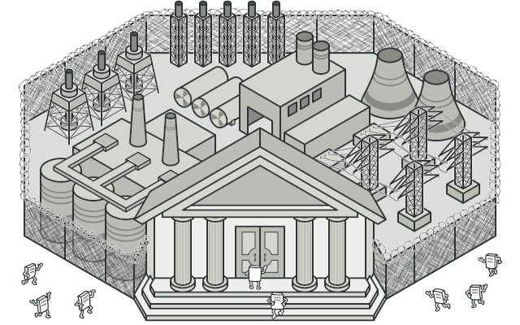

# Facade

Facade is a structural design pattern that provides a simplified interface to a library, a framework, or any other complex set of classes.



## Problem

Imagine that you must make your code work with a broad set of objects that belong to a sophisticated library or framework. Ordinarily, you’d need to initialize all of those objects, keep track of dependencies, execute methods in the correct order, and so on.

As a result, the business logic of your classes would become tightly coupled to the implementation details of 3rd-party classes, making it hard to comprehend and maintain.

## Solution

A facade is a class that provides a simple interface to a complex subsystem which contains lots of moving parts. A facade might provide limited functionality in comparison to working with the subsystem directly. However, it includes only those features that clients really care about.

Having a facade is handy when you need to integrate your app with a sophisticated library that has dozens of features, but you just need a tiny bit of its functionality.

For instance, an app that uploads short funny videos with cats to social media could potentially use a professional video conversion library. However, all that it really needs is a class with the single method encode(filename, format). After creating such a class and connecting it with the video conversion library, you’ll have your first facade.

## Applicability

- Use the Facade pattern when you need to have a limited but straightforward interface to a complex subsystem.

- Use the Facade when you want to structure a subsystem into layers.

## How to implement

1. Check whether it’s possible to provide a simpler interface than what an existing subsystem already provides. You’re on the right track if this interface makes the client code independent from many of the subsystem’s classes.

2. Declare and implement this interface in a new facade class. The facade should redirect the calls from the client code to appropriate objects of the subsystem. The facade should be responsible for initializing the subsystem and managing its further life cycle unless the client code already does this.

3. To get the full benefit from the pattern, make all the client code communicate with the subsystem only via the facade. Now the client code is protected from any changes in the subsystem code. For example, when a subsystem gets upgraded to a new version, you will only need to modify the code in the facade.

## Code example

```ts
/**
 * The Facade class provides a simple interface to the complex logic of one or
 * several subsystems. The Facade delegates the client requests to the
 * appropriate objects within the subsystem. The Facade is also responsible for
 * managing their lifecycle. All of this shields the client from the undesired
 * complexity of the subsystem.
 */
class Facade {
  protected subsystem1: Subsystem1;

  protected subsystem2: Subsystem2;

  /**
   * Depending on your application's needs, you can provide the Facade with
   * existing subsystem objects or force the Facade to create them on its own.
   */
  constructor(subsystem1?: Subsystem1, subsystem2?: Subsystem2) {
    this.subsystem1 = subsystem1 || new Subsystem1();
    this.subsystem2 = subsystem2 || new Subsystem2();
  }

  /**
   * The Facade's methods are convenient shortcuts to the sophisticated
   * functionality of the subsystems. However, clients get only to a fraction
   * of a subsystem's capabilities.
   */
  public operation(): string {
    let result = 'Facade initializes subsystems:\n';
    result += this.subsystem1.operation1();
    result += this.subsystem2.operation1();
    result += 'Facade orders subsystems to perform the action:\n';
    result += this.subsystem1.operationN();
    result += this.subsystem2.operationZ();

    return result;
  }
}

/**
 * The Subsystem can accept requests either from the facade or client directly.
 * In any case, to the Subsystem, the Facade is yet another client, and it's not
 * a part of the Subsystem.
 */
class Subsystem1 {
  public operation1(): string {
    return 'Subsystem1: Ready!\n';
  }

  // ...

  public operationN(): string {
    return 'Subsystem1: Go!\n';
  }
}

/**
 * Some facades can work with multiple subsystems at the same time.
 */
class Subsystem2 {
  public operation1(): string {
    return 'Subsystem2: Get ready!\n';
  }

  // ...

  public operationZ(): string {
    return 'Subsystem2: Fire!';
  }
}

/**
 * The client code works with complex subsystems through a simple interface
 * provided by the Facade. When a facade manages the lifecycle of the subsystem,
 * the client might not even know about the existence of the subsystem. This
 * approach lets you keep the complexity under control.
 */
function clientCode(facade: Facade) {
  // ...

  console.log(facade.operation());

  // ...
}

/**
 * The client code may have some of the subsystem's objects already created. In
 * this case, it might be worthwhile to initialize the Facade with these objects
 * instead of letting the Facade create new instances.
 */
const subsystem1 = new Subsystem1();
const subsystem2 = new Subsystem2();
const facade = new Facade(subsystem1, subsystem2);
clientCode(facade);
```

```
Facade initializes subsystems:
Subsystem1: Ready!
Subsystem2: Get ready!
Facade orders subsystems to perform the action:
Subsystem1: Go!
Subsystem2: Fire!
```
