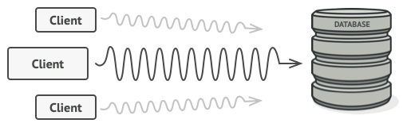
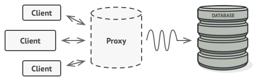
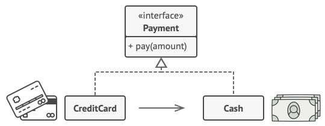

# Proxy

## Intent

Proxy is a structural design pattern that lets you provide a substitute or placeholder for another object. A proxy controls access to the original object, allowing you to perform something either before or after the request gets through to the original object.


## Problem

Why would you want to control access to an object? Here is an example: you have a massive object that consumes a vast amount of system resources. You need it from time to time, but not always.

  
You could implement lazy initialization: create this object only when it’s actually needed. All of the object’s clients would need to execute some deferred initialization code. Unfortunately, this would probably cause a lot of code duplication.

In an ideal world, we’d want to put this code directly into our object’s class, but that isn’t always possible. For instance, the class may be part of a closed 3rd-party library.

## Solution

The Proxy pattern suggests that you create a new proxy class with the same interface as an original service object. Then you update your app so that it passes the proxy object to all of the original object’s clients. Upon receiving a request from a client, the proxy creates a real service object and delegates all the work to it.



But what’s the benefit? If you need to execute something either before or after the primary logic of the class, the proxy lets you do this without changing that class. Since the proxy implements the same interface as the original class, it can be passed to any client that expects a real service object.

## Real world analogy


A credit card is a proxy for a bank account, which is a proxy for a bundle of cash. Both implement the same interface: they can be used for making a payment. A consumer feels great because there’s no need to carry loads of cash around. A shop owner is also happy since the income from a transaction gets added electronically to the shop’s bank account without the risk of losing the deposit or getting robbed on the way to the bank.

## Applicability

- Lazy initialization (virtual proxy). This is when you have a heavyweight service object that wastes system resources by being always up, even though you only need it from time to time.

- Access control (protection proxy). This is when you want only specific clients to be able to use the service object; for instance, when your objects are crucial parts of an operating system and clients are various launched applications (including malicious ones).

- Local execution of a remote service (remote proxy). This is when the service object is located on a remote server.

- Logging requests (logging proxy). This is when you want to keep a history of requests to the service object.

- Caching request results (caching proxy). This is when you need to cache results of client requests and manage the life cycle of this cache, especially if results are quite large.

- Smart reference. This is when you need to be able to dismiss a heavyweight object once there are no clients that use it.

## How to implement

1. If there’s no pre-existing service interface, create one to make proxy and service objects interchangeable. Extracting the interface from the service class isn’t always possible, because you’d need to change all of the service’s clients to use that interface. Plan B is to make the proxy a subclass of the service class, and this way it’ll inherit the interface of the service.

2. Create the proxy class. It should have a field for storing a reference to the service. Usually, proxies create and manage the whole life cycle of their services. On rare occasions, a service is passed to the proxy via a constructor by the client.

3. Implement the proxy methods according to their purposes. In most cases, after doing some work, the proxy should delegate the work to the service object.

4. Consider introducing a creation method that decides whether the client gets a proxy or a real service. This can be a simple static method in the proxy class or a full-blown factory method.

5. Consider implementing lazy initialization for the service object.

## Code Example

```ts
/**
 * The Subject interface declares common operations for both RealSubject and the
 * Proxy. As long as the client works with RealSubject using this interface,
 * you'll be able to pass it a proxy instead of a real subject.
 */
interface Subject {
  request(): void;
}

/**
 * The RealSubject contains some core business logic. Usually, RealSubjects are
 * capable of doing some useful work which may also be very slow or sensitive -
 * e.g. correcting input data. A Proxy can solve these issues without any
 * changes to the RealSubject's code.
 */
class RealSubject implements Subject {
  public request(): void {
    console.log('RealSubject: Handling request.');
  }
}

/**
 * The Proxy has an interface identical to the RealSubject.
 */
class Proxy implements Subject {
  private realSubject: RealSubject;

  /**
   * The Proxy maintains a reference to an object of the RealSubject class. It
   * can be either lazy-loaded or passed to the Proxy by the client.
   */
  constructor(realSubject: RealSubject) {
    this.realSubject = realSubject;
  }

  /**
   * The most common applications of the Proxy pattern are lazy loading,
   * caching, controlling the access, logging, etc. A Proxy can perform one of
   * these things and then, depending on the result, pass the execution to the
   * same method in a linked RealSubject object.
   */
  public request(): void {
    if (this.checkAccess()) {
      this.realSubject.request();
      this.logAccess();
    }
  }

  private checkAccess(): boolean {
    // Some real checks should go here.
    console.log('Proxy: Checking access prior to firing a real request.');

    return true;
  }

  private logAccess(): void {
    console.log('Proxy: Logging the time of request.');
  }
}

/**
 * The client code is supposed to work with all objects (both subjects and
 * proxies) via the Subject interface in order to support both real subjects and
 * proxies. In real life, however, clients mostly work with their real subjects
 * directly. In this case, to implement the pattern more easily, you can extend
 * your proxy from the real subject's class.
 */
function clientCode(subject: Subject) {
  // ...

  subject.request();

  // ...
}

console.log('Client: Executing the client code with a real subject:');
const realSubject = new RealSubject();
clientCode(realSubject);

console.log('');

console.log('Client: Executing the same client code with a proxy:');
const proxy = new Proxy(realSubject);
clientCode(proxy);
```

```
Client: Executing the client code with a real subject:
RealSubject: Handling request.

Client: Executing the same client code with a proxy:
Proxy: Checking access prior to firing a real request.
RealSubject: Handling request.
Proxy: Logging the time of request.
```
